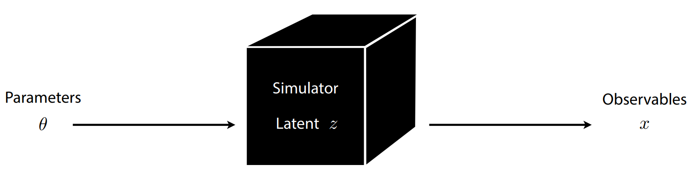
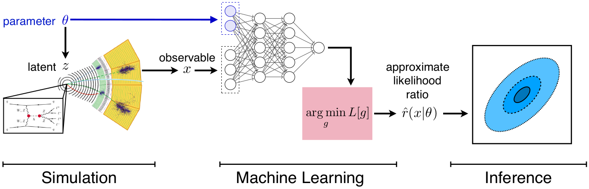
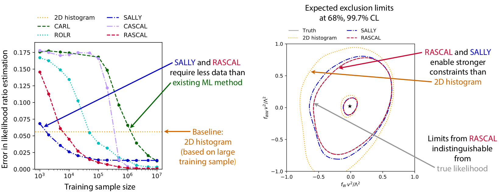
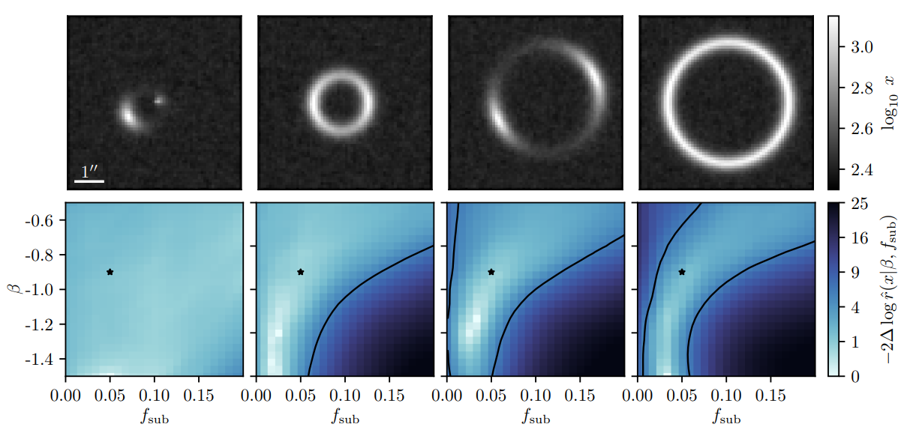

class: middle, center, title-slide
count: false

# A short introduction to  Neural Likelihood-free Inference for Physics

AMLD 2020 
January 28, Lausanne, Switzerland

  

Gilles Louppe 
[g.louppe@uliege.be](mailto:g.louppe@uliege.be)

---

class: middle, black-slide, center

# A typical science experiment

.center[<video controls autoplay loop muted preload="auto" height="480" width="640">
  <source src="./figures/galton.mp4" type="video/mp4">
</video>]

???

The Galton board is a *metaphore* of simulation-based science:
.grid.center[
.kol-2-5[Galton board device]
.kol-1-5[$\to$]
.kol-2-5[Computer simulation]
]
.grid.center[
.kol-2-5[Parameters $\theta$]
.kol-1-5[$\to$]
.kol-2-5[Model parameters $\theta$]
]
.grid.center[
.kol-2-5[Buckets $x$]
.kol-1-5[$\to$]
.kol-2-5[Observables $x$]
]
.grid.center[
.kol-2-5[Random paths $z$]
.kol-1-5[$\to$]
.kol-2-5[Latent variables $z$  (stochastic execution traces through simulator)]
]

Inference in this context requires **likelihood-free algorithms**.

---

class: middle

.center.width-100[]

.footnote[Credits: Johann Brehmer.]

---

class: center, middle, black-slide

.width-70[]

---

background-image: url(./figures/lhc.gif)
class: center, middle, black-slide

---

background-image: url(./figures/englert.jpg)
class: center, middle, black-slide

---

class: middle

## Particle physics

.center.width-90[]
.grid[
.kol-1-5.center[
SM with parameters $\theta$

.width-100[]]
.kol-2-5.center[
Simulated observables $x$

.width-80[]]
.kol-2-5.center[
Real observations $x\_\text{obs}$

.width-80[]
.width-80[]]
]

---

class: middle

.width-100[]

  

$$p(x|\theta) = \underbrace{\iiint}\_{\text{intractable!!}} p(z\_p|\theta) p(z\_s|z\_p) p(z\_d|z\_s) p(x|z\_d) dz\_p dz\_s dz\_d$$

???

Steps:
- generation: pencil and paper calculable from first principles
- parton shower + hadronization: controlled approximation of first principles + phenomenological model
- detector simulation: interaction with the materials and digitization
reconstruction simulation

Computation: that's bad!

---

# Ingredients

Statistical inference requires the computation of *key ingredients*, such as
- the likelihood $p(x|\theta)$,
- the likelihood ratio $r(x|\theta\_0,\theta\_1) = \frac{p(x|\theta\_0)}{p(x|\theta\_1)}$,
- or the posterior $p(\theta|x)$.

In the simulator-based scenario, each of these ingredients can be approximated with modern machine learning techniques, **even if none are tractable during training**!

---

# Cᴀʀʟ

Supervised learning provides a way to **automatically** learn $p(x|\theta\_0) / p(x|\theta\_1)$:
- Let us consider a neural network classifier $\hat{s}$ tasked to distinguish $x\_i \sim p(x|\theta\_0)$ labelled $y\_i=0$ from $x\_i \sim p(x|\theta\_1)$ labelled $y\_i=1$.
- Train $\hat{s}$ by minimizing the cross-entropy loss.

.center.width-50[]

.footnote[Cranmer, Pavez and Louppe, 2015 [[arXiv:1506.02169](https://arxiv.org/abs/1506.02169)].]

???

Explain the figure

---

class: middle

The solution $\hat{s}$ found after training  approximates the optimal classifier
$$\hat{s}(x) \approx s^\*(x) = \frac{p(x|\theta\_1)}{p(x|\theta\_0)+p(x|\theta\_1)}.$$

Therefore, $$r(x|\theta\_0,\theta\_1) \approx \hat{r}(x|\theta\_0,\theta\_1)=\frac{1-\hat{s}(x)}{\hat{s}(x)}.$$

.footnote[Cranmer, Pavez and Louppe, 2015 [[arXiv:1506.02169](https://arxiv.org/abs/1506.02169)].]

---

class: middle

.center.width-100[]

.footnote[Cranmer, Pavez and Louppe, 2015 [[arXiv:1506.02169](https://arxiv.org/abs/1506.02169)].]

---

class: middle

.center[
<video preload="auto" height="400" width="750" autoplay loop>
  <source src="./figures/toolbox.mp4" type="video/mp4">
</video>

Since  **supervised classification** is equivalent to *likelihood ratio estimation*, the whole Deep Learning toolbox can be used for inference!
]

.footnote[Credits: [Oriol Vinyals](https://twitter.com/OriolVinyalsML/status/1212422497339105280), 2020.]

---

class: middle

## There is more...

.center.width-100[]

.footnote[Brehmer, Louppe, Pavez and Cranmer, 2018 [[arXiv:1805.12244](https://arxiv.org/abs/1805.12244)].]

---

# Bayesian inference

.grid[
.kol-1-2[

 
Bayesian inference = computing the posterior
$$p(\theta|x) = \frac{p(x|\theta) p(\theta)}{p(x)}.$$

]
.kol-1-2[.width-100[]]
]

Doubly **intractable** in the likelihood-free scenario:
- Cannot evaluate the likelihood $p(x|\theta) = \int p(x,z|\theta) dz$.
- Cannot evaluate the evidence $p(x) = \int p(x|\theta)p(\theta) d\theta$.

???

One can learn the likelihood-to-evidence ratio with SL.

---

class: middle

## Approximate Bayesian Computation (ABC)

.center.width-100[]

## Issues

- How to choose $x'$? $\epsilon$? $||\cdot||$?
- No tractable posterior.
- Need to run new simulations for new data or new prior.

.footnote[Credits: Johann Brehmer.]

---

class: middle

## Amortizing Bayes

The Bayes rule can be rewritten as
$$p(\theta|x) = \frac{p(x|\theta) p(\theta)}{p(x)} = r(x|\theta) p(\theta) \approx \hat{r}(x|\theta)p(\theta),$$
where $r(x|\theta) = \frac{p(x|\theta)}{p(x)}$ is the likelihood-to-evidence ratio.

The likelihood-to-evidence ratio can be learned with a neural network tasked to distinguish  $x \sim p(x|\theta)$  from $x \sim p(x)$.

This enables *direct* and **amortized**  posterior evaluation.
.grid.center[
.kol-1-2[.width-70[]]
.kol-1-2[ .width-100[] ]
]

.footnote[Hermans, Begy and Louppe, 2019 [[arXiv:1903.04057](https://arxiv.org/abs/1903.04057)]; Brehmer, Mishra-Sharma, Hermans, Louppe, and Cranmer, 2019 [[arXiv:1909.02005](https://arxiv.org/abs/1909.02005)].]

???

This is helpful when you known you will have to run posterior inference many times.

---

class: middle
count: false

# Showtime

---

class: middle

.grid[
.kol-3-5[
## ① Hunting new physics at particle colliders

The goal is to constrain two EFT parameters and compare against traditional histogram analysis.
]
.kol-2-5.width-100.center[]
]

.center.width-100[]

.footnote[Brehmer, Cranmer, Louppe, and Pavez, 2018a [[arXiv:1805.00020](https://arxiv.org/abs/1805.00020)], 2018b [[arXiv:1805.00013](https://arxiv.org/abs/1805.00013)]; Brehmer, Louppe, Pavez and Cranmer, 2018 [[arXiv:1805.12244](https://arxiv.org/abs/1805.12244)].]

---

class: middle, black-slide

## ② Dark matter substructure from gravitational lensing

.center[.width-45[] .width-45[]]

.grid[
.kol-1-3[
Number of dark matter subhalos and their mass and location lead to complex latent space of each image. The goal is the .bold[inference of population parameters $\beta$ and $f\_\text{sub}$.]
]
.kol-2-3.width-100[]
]

.footnote[Brehmer, Mishra-Sharma, Hermans, Louppe, and Cranmer, 2019 [[arXiv:1909.02005](https://arxiv.org/abs/1909.02005)].]

???

A dark halo is the inferred halo of invisible material (dark matter) that permeates and surrounds individual galaxies.

A single halo may contain multiple virialized clumps of dark matter bound together by gravity, known as subhalos.

The halo and its constituents have a predictable effect on the lenses.

$\beta$ and $f\_\text{sub}$ parameterize the subhalo mass function i.e. the distribution of subhalo masses in a given host halo.

---

class: middle

.width-100[]

.footnote[Brehmer, Mishra-Sharma, Hermans, Louppe, and Cranmer, 2019 [[arXiv:1909.02005](https://arxiv.org/abs/1909.02005)].]

???

Between the LHC stuff and the lensing, we’re using the same methods across 37 orders of magnitude in length scale.

---

class: black-slide, middle

## ③ Constraining the WDM particle mass

.center[.width-45[] .width-45[]]

Reveal the nature of the  dark matter model via the observations of stellar streams to .bold[constrain the mass of the dark matter particle].

???

- The spatial distribution of subhalos reveals the dark matter model (which depends on m_wdm).
- The n-body simulations predict this particular structure (left top figure). Sadly, we can't see this (dark) matter. We need some indirect evidence which interacts with the subhalos in the halo of the galaxy -> stellar streams move through this region.
- The stars in a stream interact gravitationally  with the subhalos, causing disturbances in the stellar density of the stream.
- These disturbances are in function of m_wdm.
- Dealing with the nuisance parameters (bar of the galaxy, gravitational interaction with the spiral arms and molecular clouds), times which the subhalos have impacted the streams (and their population parameters), initial conditions, ...
- By constraining the mass we essentially (by proxy) infer the DM model.

---

class: middle, center

.width-100[]

---

class: middle

## ④ Fast parameter estimation for gravitational waves 

.grid[
.kol-1-2[.center.width-90[]]
.kol-1-2[.center.width-100[]]
]

---

# Summary

- Much of modern science is based on "likelihood-free" simulations.
- The likelihood-ratio is central to many statistical inference procedures, regardless of your religion.
- Supervised learning enables likelihood-ratio estimation.
- Better likelihood-ratio estimates can be achieved by mining simulators.

  
.center.width-90[]

---

count: false

# Collaborators

 

.center.grid[
.kol-1-6[]
.kol-1-6.center[.width-100[] Kyle Cranmer]
.kol-1-6.center[.width-100[] Juan Pavez]
.kol-1-6.center[.width-100[] Johann Brehmer]
.kol-1-6.center[.width-90[] Joeri Hermans]
]

.grid[
.kol-1-6[]
.kol-1-6.center[.width-100[] Antoine Wehenkel]
.kol-1-6.center[.width-100[] Arnaud Delaunoy]
.kol-1-6.center[.width-90[] Siddarth Mishra-Sharma]
]

---

count: false

# References

.small-font[
- Cranmer, K., Brehmer, J., & Louppe, G. (2019). The frontier of simulation-based inference. arXiv preprint arXiv:1911.01429.
- Brehmer, J., Mishra-Sharma, S., Hermans, J., Louppe, G., Cranmer, K. (2019). Mining for Dark Matter Substructure: Inferring subhalo population properties from strong lenses with machine learning. arXiv preprint arXiv 1909.02005.
- Hermans, J., Begy, V., & Louppe, G. (2019). Likelihood-free MCMC with Approximate Likelihood Ratios. arXiv preprint arXiv:1903.04057.
- Stoye, M., Brehmer, J., Louppe, G., Pavez, J., & Cranmer, K. (2018). Likelihood-free inference with an improved cross-entropy estimator. arXiv preprint arXiv:1808.00973.
- Brehmer, J., Louppe, G., Pavez, J., & Cranmer, K. (2018). Mining gold from implicit models to improve likelihood-free inference. arXiv preprint arXiv:1805.12244.
- Brehmer, J., Cranmer, K., Louppe, G., & Pavez, J. (2018). Constraining Effective Field Theories with Machine Learning. arXiv preprint arXiv:1805.00013.
- Brehmer, J., Cranmer, K., Louppe, G., & Pavez, J. (2018). A Guide to Constraining Effective Field Theories with Machine Learning. arXiv preprint arXiv:1805.00020.
- Cranmer, K., Pavez, J., & Louppe, G. (2015). Approximating likelihood ratios with calibrated discriminative classifiers. arXiv preprint arXiv:1506.02169.
]

---

class: end-slide, center
count: false

The end.
